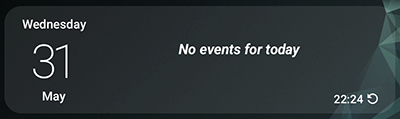
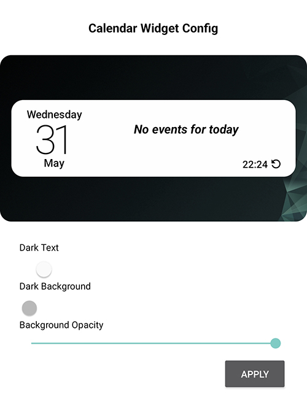
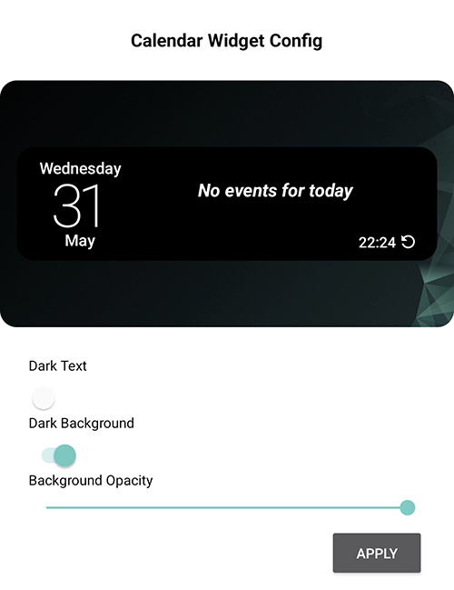

# AndroidCalendarWidget
This is an Android Calendar Widget app which shows todays date and events for today.

- Min Target SDK = 31
- Target SDK = 33
- Version = 1.0
- Build = 6

## The Widget

## Config Screen
Dark Text on light background

Light Text on dark background

# TODO
- Add android device dark mode setting to automatically adjust according to the device settings.